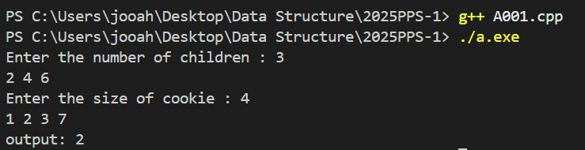

# PPS Camp C++ week1
22100480 / 윤주안

### C++ week1
- A001. Assign Cookies

### 설명
-A001. Assign Cookies
각 아이 최대 1개 쿠키 지급 가능
아이 i g[i] : 만족도
쿠키 j s[j] : 크기
s[j] >= g[i] 일때 쿠키 지급 가능
예: 2 4 6 / 1 2 3 이면 1:1대응인 경우 output이 0이 되기에, 
각각 index를 지정, 아이의 만족도가 쿠키의 크기보다 작거나 같은경우를 성립하면 -> 둘다 index를 증가,
아이의 만족도가 더 크면 쿠키의 index만 증가시켜 다시 비교한다. 그리고 현재 만족한 아이의 명수를 반환. 
