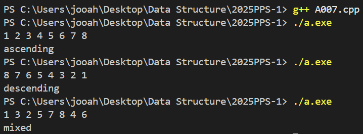

# PPS Camp C++ week1
22100480 / 윤주안

## A001. Assign Cookies

각 아이 최대 1개 쿠키 지급 가능
아이 i g[i] : 만족도
쿠키 j s[j] : 크기
s[j] >= g[i] 일때 쿠키 지급 가능
예: 2 4 6 / 1 2 3 이면 1:1대응인 경우 output이 0이 되기에, 
각각 index를 지정, 아이의 만족도가 쿠키의 크기보다 작거나 같은경우를 성립하면 -> 둘다 index를 증가,
아이의 만족도가 더 크면 쿠키의 index만 증가시켜 다시 비교한다. 그리고 현재 만족한 아이의 명수를 반환. 

## A002. Pascal's Triangle

이중 벡터 vector<vector<int>>를 사용하고 있다. 
처음에 for(int i=0;i<numRows;++i) : 반복횟수를 지정.
vector<int>row(i+1, 1) : 해당 열을 생성, 초기값을 1로 고정.
row[j] = result[i-1][j-1] + result[i-1][j] : 처음과 끝원소를 제외한 중간값들은 파스칼 덧셈으로 구한다.
vector는 cout으로 바로 출력할 수 없기에 for반복문 사용.
문제에서 output이 ,로 이루어져 있음을 확인. 
처음에는, for(int num : row)이런식으로 하나씩 끄집어내서 출력하는 방식을 구사했는데 그러면 마지막 값뒤에 ","가 출력되서 마지막 원소를 확인해야했다. 
그렇기에 for(int i=0;i<row.size();++i)를 사용했고 i가 row.size()-1에 해당하는 경우 "," 없이 출력.
이번에는 마지막 row 뒤에 ","가 출력되는것을 확인했고 마지막 row를 확인해야했다.
for(auto it = m.begin(); it != m.end(); ++it)를 사용, m.end()-1에 해당하는 경우 ","없이 출력하도록 했다.

## A003. Plus One

input형태가 [1,2,3]이런 구조라서, 일단 getline(cin, line)으로 전체를 string으로 읽어들이고 
그중에서 숫자만 뽑아서 int로 변형해서 g.push_back(n);을 한다. 
원래는 string 123을 int 123로 만든후 +1을 하고 그냥 124를 [1,2,4]의 형태로 바꾸는 간단한 방식을 생각했으나,
문제에서 사용하는 함수는 vector<int>digits을 인자로 받고 있기에, vector<int>g자체를 인자로 전달하는 방식으로 구현해야됨을 깨달았다. 
맨 뒤의 자리부터 확인하기에 for문에서 i는 digits.size()-1부터 시작하도록 했고, 
만약 한번이라도 9보다 작은 수가 나오면 +1을 하고 바로 return하도록 했다. 그렇지 않은 경우 즉 숫자가 9인경우에는 
계속해서 현재 값을 0으로 바꾸고 앞의 자리를 확인하도록 했다. 만약 모두 9가 입력된 숫자라서 for반복문을 
빠져나온 경우에는 digits.insert(digits.begin(),1);을 사용해서 맨 앞에 1을 추가하도록 구현했다.  

## A004. 나누어 떨어지는 숫자 배열

[10,45,39] 이런식으로 입력이 받았다고 했을때, [ , ] 이 3가지를 모두 공백으로 변환하고,
istringstream으로 공백을 처리하여 숫자만 int로 변환하여 vector <int> g에 push_back한다.
solution 함수에 g를 인자로 받고, 처음부터 끝까지 하나씩 divisor로 나눴을때 0으로 나눠떨어지는지를 판별, 
해당하는 경우에 answer.push_back를 한다. for반복문이 끝난후에는 empty인지를 판별하여 해당하는 경우 -1를 push_back한다. 
그리고 처음부터 끝까지를 sort한다. 

## A005. 스킬트리 

skill와 skill_trees를 입력받고, 
solution 함수에서 각각의 skill_trees를 하나씩 꺼내서 skill와 비교,
skill_trees[i]에서 문자 한개씩 꺼내서 skill안에 들어있는지 skill.find(c)를 이용해 찾기 
찾은 경우에 string find에 추가한다. 
마지막으로 처음부터 find의 size까지의 문자가 동일한지 판별
같은 경우에 answer를 +1한다. 

## A006. 문자열 내 p와 y의 개수

main에서는 string을 입력받고 각각의 값이 p P y Y에 해당하는 경우
string s에 소문자로 바꿔서 추가한다. 
solution 메서드에서는 count를 0으로 초기화하고, 
s의 각 문자가 p인 경우 count를 +1 y인경우 -1하여 
count값이 0이 되는 경우에 p, y의 갯수가 같음을 의미하기에 
true(1)를 반환, 그외의 경우 false(0)을 반환한다. 

## A007. 음계 판별하기

main에서 배열 8자리를 입력받는다. 
solution 메서드에서 8자리를 판별할때 asc, des 두가지를 사용한다.
index 1부터 시작해서, 현재 값이 이전 array 값보다 크면 asc를 +1하고, 작으면 des +1한다.
asc = 7이면 오름차순정렬이기에 ascending반환, des = 7이면 내림차순정렬이기에 descending반환
그외의 경우 mixed를 반환한다. 

## A008. 평균은 넘겠지

함수따로 구현안하고 구현해야되는 것들 그대로 하나씩 순서대로 구현했다.
처음에 총 반복횟수 n을 입력, 최종적으로 입력받을 %값들 double arr[n];을 선언,
반복할 횟수를 num으로 입력받고 int score[num]선언. 
각각의 score값을 입력받고 sum에 추가하여, 평균값을 구한다. 
다시 각각의 score값을 비교하며 평균보다 큰값이면 count를 1증가한다. 
마지막으로 count를 num으로 나눈뒤 100을 곱하여 평균보다 큰 경우의 %를 구한다.

## A009. 문자열 다루기 기본

제한조건, 사용자가 입력한 string의 size가 1보다 작고 8보다 큰 경우 
조건이 성립할때까지 while문으로 입력을 받는다. 
size가 4 또는 6인경우 solution 메서드를 호출, 그렇지 않은 경우 바로 false출력한다. 
solution 메서드 호출시 모든 문자가 숫자인지 판별하여 한번이라도 숫자가 아닌경우
bool type answer를 false로 바꾼다. answer를 반환한다. 

## A010. 문자열 압축

반복할려면 최소 블럭이 2개 이상 존재해야한다. 
문자열의 길이 >= 블럭단위 * 2;인데
블럭단위 <= 문자열의 길이 / 2가 된다. 
시작할때 블록 part = s.substr(0,i)로 두고, 
그다음 구간 next와 비교해서 중복이 되는 경우 count를 1증가한다.
최종적으로 count가 1보다크면 중복횟수count를 newline에 추가하고, 반복된 구간도 추가한다. 
마지막 문자는 그다음 구간이 없어서 비교할 수 없으므로 마지막에 판별해준다. 

## A011. 실패율

해당하는 경우 1/8 -> 3/7 -> 2/4 이렇게 자르기 위해 
처음에 입력받은 값을 sort한 후, solution메서드에 보내준다.
stage가 1부터 시작이기에 j=1부터 시작, 현재 stages[j-1]의 값이 i와 같다면 count를 계속 증가한다.
만약 달라질 경우, 분모가 0이 되면 안되기에 stages.size()가 0이 아닌지 판별, 
실패율 배열에 현재 count값을 stages.size로 나눈 값을 저장한다. 현재 for문을 break 빠져나간후,
처음부터 count한 횟수만큼 삭제한다. 이과정을 i가 stageN에 도달할때까지 반복한다.
실패율을 기준으로 sorting 해야하는데 이과정에서 현재 stage가 무엇인지 즉, index값을 기억해야되서
vector<pair<double, int>>p를 선언했다. 실패율 배열과 index(현재 stage값)를 같이 저장시킨다. 
sort할때 실패율이 더 큰것을 앞에 오도록 return하지만 실패율이 같다면, 
두번째 stage의 값이 작은것이 앞에 오도록 return 한다. 
마지막으로 vector<int> answer를 선언하고 p에서 pair<double, int>k로 하나씩 넘기면서 
k.second stage값을 push_back한다.  

## A012. Count Primes

입력된 n보다 작은 값중에 소수가 몇개인지를 구하는 문제
수작업을 하되 최대한 경우의 수를 줄이도록 
2보다 작으면 0, 2인경우 1을 return.
i=3부터 시작, 그외에 짝수인경우는 소수가 아니므로 i+=2로 제외한다.
소수는 1과 본인을 제외하고 약수 즉 나누어떨어지는 수가 0인 경우이므로,
2부터 i보다 작을때까지 나누어떨어지지를 판별하여 0이 되는 경우 count를 증가시켜 
count가 0인경우 소수이므로, num을 증가한다. 

## A013. Single Number

sorting이후, 두번 연속해서 나오지 않는 경우 해당 숫자를 출력한다.
size가 1인경우 nums[0]을 바로 출력
현재 값과 다음 값을 비교, 같으면 count = 1, 
다르면 현재 count값이 1인경우는 count값을 0으로 만들고 다음 자릿수 확인
count가 1이 아닌경우 반복이 이루어지지 않았기에 해당 숫자를 return한다. 

## A014. Summary Ranges

현재 원소에 1 더한 값이 다음 원소값이랑 같은지 판별하여 
같은 경우에는 연속이므로 count를 증가한다. 
연속하지 않는 경우에는 break를 한다.
현재 자릿수를 끝원소로 하고, 만약 처음과 끝이 같다면 
그냥 현재 원소를 push_back하고 다르다면 
처음부터 끝원소까지 push_back하고 erase시킨다.  

## A015. 검증수

입력받은 값을 두번 곱한값을 sum에다가 저장한다.
총 5번반복, sum을 10으로 나눈 나머지를 출력한다.

## A016. 구명보트

무게를 오름차순으로 sorting하고, solution메서드로 보낸다.
맨앞은 가장 가벼운 무게, 맨뒤는 가장 무거운 무게인데
무거운 순서대로 맨뒤에를 1개 pop해서 삭제하고 
if 가장 가벼운 무게와의 합이 limit보다 작은지를 판별, 함께 erase한다. 